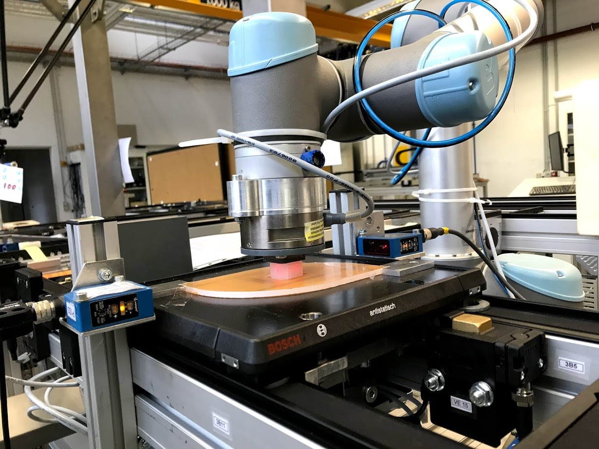

# Hierarchical Motion Control for Industrial Robots 
- In multi axes machine tools, objects including difficult to manufacture and deformable shapes are manipulated using real time motion control. Industrial robots as intelligent manufacturing tools are adapted to new geometric variants and mechanical properties using sensor models in automated production system.

- In this work, we propose a hierarchical controller approach to control a motion of an industrial robot at real time. The approach considers tool center point force property and joint space variables to derive a robust motion control that hierarchically adapts to the level of object deformation.

The project is submitted to the forthcoming conference: "CIRP Manufacturing Systems Conference 2019"

# How to use the code:
In order to use this code, please follow the following,
## Clone universal robot ROS package 
For the ROS package of Universal Robot, check at https://github.com/ros-industrial/universal_robot.git'

## Clone Net F/T Sensor ROS package 
For the ROS package of Net F/T sensor check at: https://github.com/epfl-lasa/net-ft-ros.git

## How to use the code: 
- Launch ROS using roscore

- Launch Universal robot and configure the IP-Address from ROS 

- Launch Net F/T Sensor and configure the IP - Address from ROS

- Check if the connection is established. From terminal use: ping 192.168.1.10 / 192.168.1.1 based on the IP Address of the configuration

- If the connection is successful - before you continue check for simple test to check the system.

- Then RUN main_file.py and visualize your data based on your requirment. 

# Result

## Experimental setup and system configuration:

## Real time simulation 

